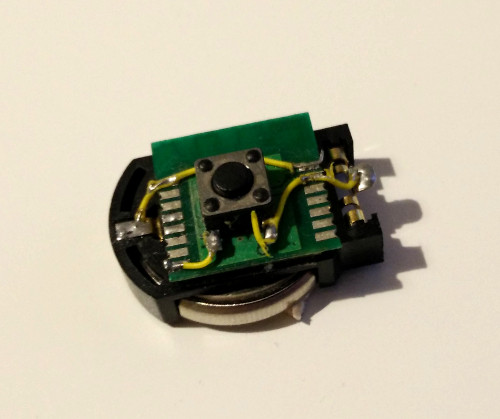

# What is it ?

This is an aplication for nRF51822 chip made by Nordic Semiconductor. It was developed to work on ptr5518 chip that can be easily purchased in one of china internet stores such as Aliexpress.

When button is pressed, 10 beacon messages with custom data is sent out. CR2032 battey should last for years as it is sleeping for most of time. Chip is woken up only after pressing button and it goes to sleep mode after sending beacons.

Prototype:

# Schematic 
TODO

# Dependencies
You have to use SoftDevice 110
https://www.nordicsemi.com/eng/Products/S110-SoftDevice-v7.0

# How to run it?

Set two variables in Makefile: NRF51_SDK and GCC_LOCATION 

- flash softdevice
- make application
- flash application using openocd

